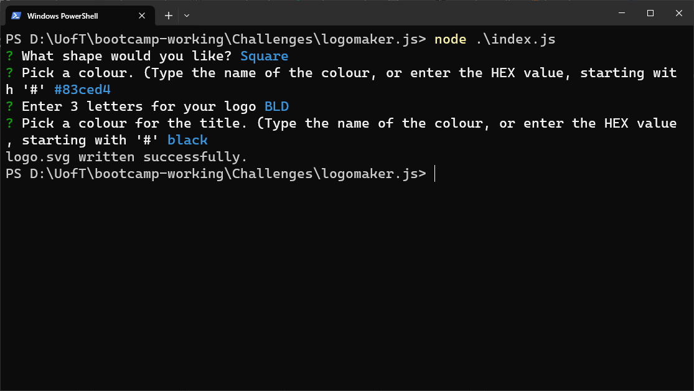

# LogoMaker.JS
  
  [Link to walkthrough video](https://youtu.be/bz_NHC7peW8)
  ## Description
  LogoMaker.JS makes it easy to create a basic logo for your project or website. Answer a few quick questions and you'll have a new logo for your project or website.
  ## Table of Contents
- [LogoMaker.JS](#logomakerjs)
  - [Description](#description)
  - [Table of Contents](#table-of-contents)
